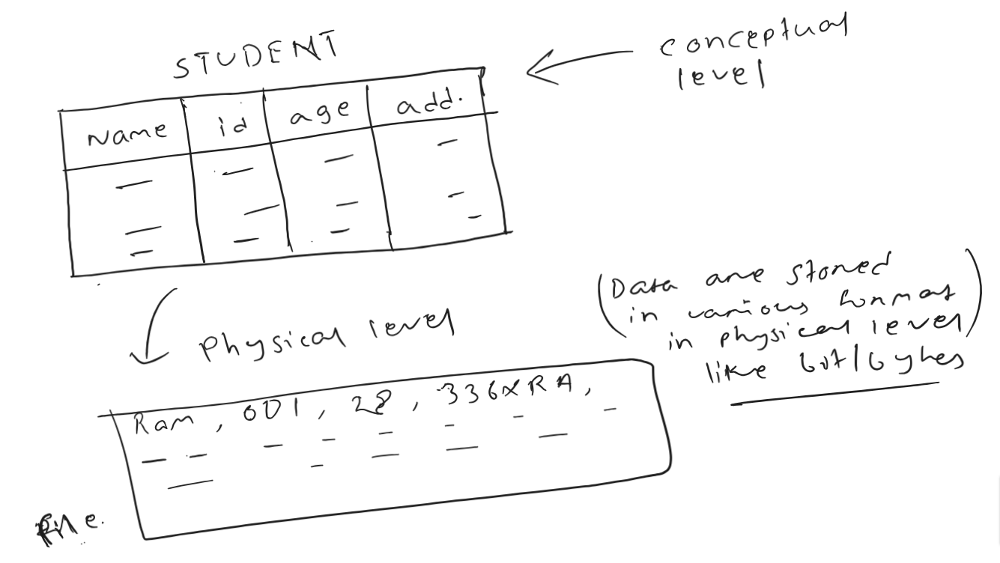

Before moving into DBMS architecture let's understand some basic terminologies.

## What is Abstraction?

- Abstraction is the process of hiding the internal details of an application from the outer world.
- Think of an ATM the internal workings of an ATM like how the circuit is connected, how money is stored, etc are not required to know by the end user to withdraw money.

Let's start with DBMS architecture

## View of Data (Three Schema Architecture)

- The major purpose of DBMS is to provide users with an abstract view of the data. That is, the
  system hides certain details of how the data is stored and maintained.
- The main objective of three level architecture is to enable multiple users to access the same data
  with a personalized view while storing the underlying data only once

### Internal level / Physical level

- Physical level of a database describes how the data is being stored in secondary storage devices like disks and tapes and also gives insights on additional storage details.
- It is the lowest level of abstraction describes how the data are stored.
- Low-level data structures used.
- It has Physical schema which describes physical storage structure of DB.
- Talks about: Storage allocation (N-ary tree etc), Data compression & encryption etc.
- Goal: We must define algorithms that allow efficient access to data.

### Logical level / Conceptual level:

- At conceptual level, data is represented in the form of various database tables. For Example, STUDENT database may contain STUDENT and COURSE tables which will be visible to users but users are unaware of their storage. Also referred as logical schema,
- The conceptual schema describes the design of a database at the conceptual level, describes what data are stored in DB, and what relationships exist among those data.
- User at logical level does not need to be aware about physical-level structures.
- DBA, who must decide what information to keep in the DB use the logical level of abstraction.
- Goal: ease to use.

### View level / External level:

- Highest level of abstraction aims to simplify users’ interaction with the system by providing different view to different end-user.
- Each view schema describes the database part that a particular user group is interested and hides the remaining database from that user group.
- At the external level, a database contains several schemas that sometimes called as subschema.
- The subschema is used to describe the different view of the database.
- At views also provide a security mechanism to prevent users from accessing certain parts of DB.
- For Example, FACULTY of a university is interested in looking course details of students, STUDENTS are interested in looking at all details related to academics, accounts, courses and hostel details as well
